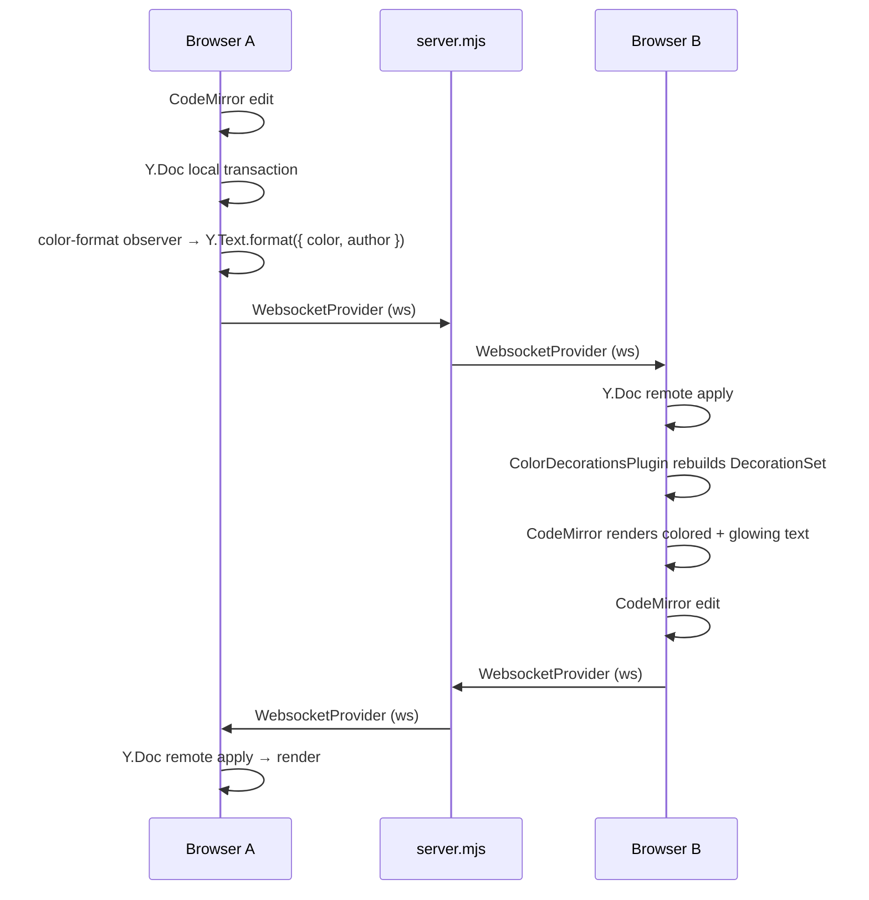
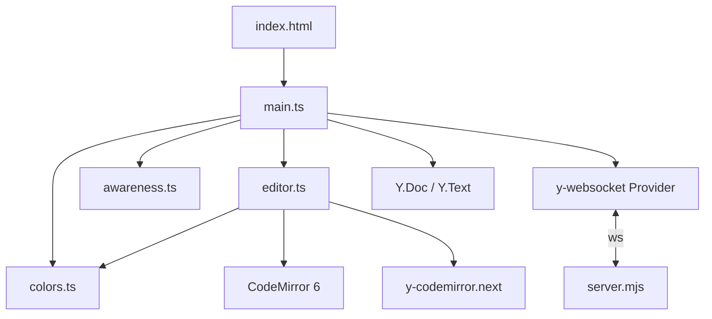

# multinput

A collaborative text editor where every user's keystrokes glow in a different color. Multiple browsers connect to a shared document over WebSockets; each participant is assigned a unique neon shade, and their text lights up accordingly in real time.

Built on Yjs for conflict-free replicated data, CodeMirror 6 for editing, and a minimal Node WebSocket relay. The UI is dark-on-black with a glassmorphism editor surface, neon text rendering, and live presence indicators.

## What it does

- **Shared document** -- open the app in several browser tabs (or machines) and type. Every keystroke syncs instantly through a central WebSocket server.
- **Per-user colored text** -- each participant is assigned a named shade (Moonstone, Ghost Orchid, Pale Flame, etc.). Text they type is permanently colored and glows in that shade.
- **Presence awareness** -- a footer bar shows every connected user with their color. Remote cursors are visible inline in the editor.
- **Collision resolution** -- if two users end up with the same shade (e.g. due to a race), the higher-numbered client automatically re-rolls and recolors its existing text.

## Architecture

The project is a flat set of four client-side TypeScript modules, one standalone server, and a single CSS file.

```
index.html          HTML shell (editor mount, status bar, presence footer)
server.mjs          y-websocket relay server (Node + ws)
src/
  main.ts           Bootstrap: Y.Doc, WebsocketProvider, DOM wiring, presence list
  editor.ts         CodeMirror 6 setup (theme, extensions, yCollab binding)
  awareness.ts      User identity: shade selection, name-collision resolution
  colors.ts         Y.Text formatting on insert + CodeMirror mark decorations
  style.css         All styling (glassmorphism surface, neon text, cursors, presence)
tests/
  helpers/ws-server.ts   In-process WS server for Playwright tests
```

### Data flow



### Module dependencies



1. **`main.ts`** creates a `Y.Doc`, connects a `WebsocketProvider` to the relay, initializes the editor, and renders the presence list from Awareness state changes.

2. **`editor.ts`** builds a CodeMirror 6 `EditorView` with `basicSetup`, a dark neon theme, `yCollab` for CRDT-backed editing, and the `colorDecorations` plugin.

3. **`awareness.ts`** picks an available shade from a palette of 12 named colors, avoiding names already claimed by other clients. A collision guard watches Awareness updates; if a duplicate is detected, the higher `clientID` re-rolls and broadcasts its new identity.

4. **`colors.ts`** has two halves:
   - **Write side** (`setupColorWriter`): observes local `Y.Text` inserts and applies a `format()` call tagging each range with `{ color, author }`.
   - **Read side** (`colorDecorations`): a CodeMirror `ViewPlugin` that walks the Yjs delta, converts color attributes into inline `style` decorations with `text-shadow` glow, and rebuilds on every change.

5. **`server.mjs`** is a room-based y-websocket relay. Each room holds a `Y.Doc` and an `Awareness` instance. The server handles Yjs sync and awareness messages, cleans up client state on disconnect, and destroys empty rooms.

### Key libraries

| Library                                                       | Role                                                     |
| ------------------------------------------------------------- | -------------------------------------------------------- |
| [Yjs](https://github.com/yjs/yjs)                             | CRDT document model (`Y.Doc`, `Y.Text`)                  |
| [y-websocket](https://github.com/yjs/y-websocket)             | Client-side WebSocket sync provider                      |
| [y-codemirror.next](https://github.com/yjs/y-codemirror.next) | Bridges Yjs <-> CodeMirror 6 (cursor sync, undo manager) |
| [CodeMirror 6](https://codemirror.net/)                       | Text editor (state, view, extensions)                    |
| [ws](https://github.com/websockets/ws)                        | Node WebSocket server                                    |
| [Vite](https://vite.dev/)                                     | Dev server and bundler                                   |

## Running

```bash
npm install

npm run start     # WS server (background) + Vite dev server
# or separately:
npm run server    # just the WS relay on :1234
npm run dev       # just Vite

npm test                # Node integration test (needs server on :1234)
npx playwright test     # E2E tests (starts its own Vite + WS server)
```

Open `http://localhost:5173` in multiple tabs to collaborate.
