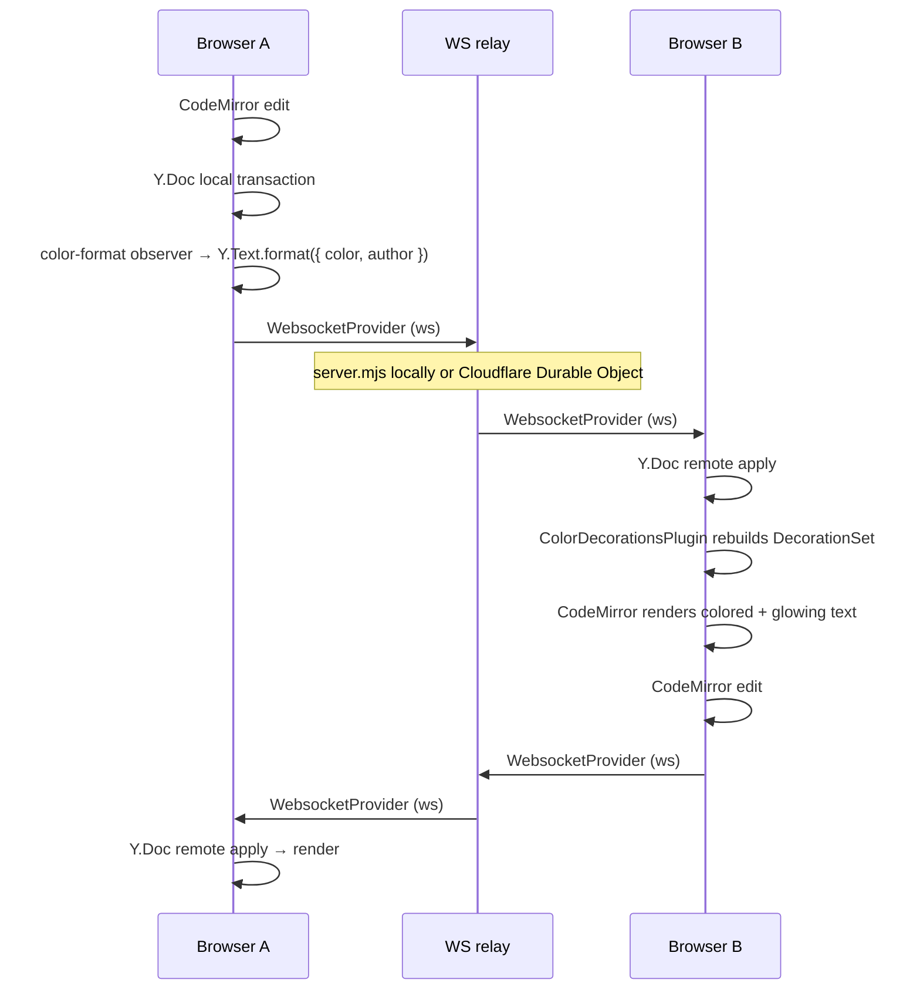
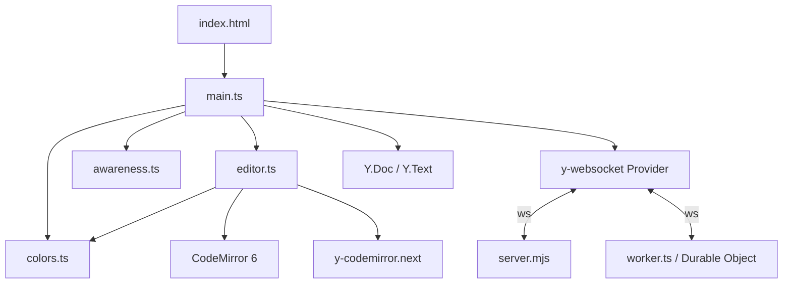

# Shake gently

> To Make A Dadaist Poem
> Take a newspaper.
> Take some scissors.
> Choose from this paper an article the length you want to make your poem.
> Cut out the article.
> Next carefully cut out each of the words that make up this article and put them all in a bag.
> Shake gently.
> Next take out each cutting one after the other.
> Copy conscientiously in the order in which they left the bag.
> The poem will resemble you.
> And there you are–an infinitely original author of charming sensibility, even though unappreciated by the vulgar herd.
>
> Tristan Tzara — (1896-1963)

A collaborative text editor where every user's can write using it's own color. Multiple users can connect to a shared document over WebSockets; each participant is assigned a unique color shade, and their text is shared in real time.

Built on Yjs for conflict-free replicated data, CodeMirror 6 for editing, and a y-websocket-compatible relay that can run either as the local Node server or as a Cloudflare Worker with Durable Objects. The UI is dark-on-black with a glassmorphism editor surface, neon text rendering, and live presence indicators.

## What it does

- **Shared document** -- open the app in several browser tabs (or machines) and type. Every keystroke syncs instantly through either the local Node WebSocket server or the Cloudflare Durable Object backend.
- **Per-user colored text** -- each participant is assigned a named shade (Moonstone, Ghost Orchid, Pale Flame, etc.). Text they type is permanently colored and glows in that shade.
- **Presence awareness** -- a footer bar shows every connected user with their color. Remote cursors are visible inline in the editor.
- **Collision resolution** -- if two users end up with the same shade (e.g. due to a race), the higher-numbered client automatically re-rolls and recolors its existing text.

## Architecture

The project is a flat set of four client-side TypeScript modules, two interchangeable WebSocket backends, and a single CSS file.

```
index.html          HTML shell (editor mount, status bar, presence footer)
server.mjs          y-websocket relay server (Node + ws)
wrangler.jsonc      Cloudflare Worker, assets, and Durable Object config
test-cf-config.mjs  Cloudflare deployment invariant test
src/
  main.ts           Bootstrap: Y.Doc, WebsocketProvider, DOM wiring, presence list
  editor.ts         CodeMirror 6 setup (theme, extensions, yCollab binding)
  awareness.ts      User identity: shade selection, name-collision resolution
  colors.ts         Y.Text formatting on insert + CodeMirror mark decorations
  worker.ts         Cloudflare Worker + Durable Object y-websocket relay
  worker-configuration.d.ts
                    Generated Wrangler runtime and binding types
  style.css         All styling (glassmorphism surface, neon text, cursors, presence)
tests/
  helpers/
    ws-server.ts         In-process WS server for Playwright tests
    constants.ts         Shared test ports and URLs
    global.d.ts          Window type augmentation for test evaluate() calls
```

### Data flow



### Module dependencies



1. **`main.ts`** creates a `Y.Doc`, connects a `WebsocketProvider` to the relay, initializes the editor, and renders the presence list from Awareness state changes.

2. **`editor.ts`** builds a CodeMirror 6 `EditorView` with `basicSetup`, a dark neon theme, `yCollab` for CRDT-backed editing, and the `colorDecorations` plugin.

3. **`awareness.ts`** picks an available shade from a palette of 12 named colors, avoiding names already claimed by other clients. A collision guard watches Awareness updates; if a duplicate is detected, the higher `clientID` re-rolls and broadcasts its new identity.

4. **`colors.ts`** has two halves:
   - **Write side** (`setupColorWriter`): observes local `Y.Text` inserts and applies a `format()` call tagging each range with `{ color, author }`.
   - **Read side** (`colorDecorations`): a CodeMirror `ViewPlugin` that walks the Yjs delta, converts color attributes into inline `style` decorations with `text-shadow` glow, and rebuilds on every change.

5. **`server.mjs`** is the local room-based y-websocket relay. Each room holds a `Y.Doc` and an `Awareness` instance. The server handles Yjs sync and awareness messages, cleans up client state on disconnect, and destroys empty rooms.

6. **`worker.ts`** provides the Cloudflare backend. The Worker routes each WebSocket room path to `ROOMS.getByName(roomName)`, and each Durable Object keeps its own in-memory `Y.Doc`, `Awareness`, and connected peers while the room is active.

### Key libraries

| Library                                                       | Role                                                     |
| ------------------------------------------------------------- | -------------------------------------------------------- |
| [Yjs](https://github.com/yjs/yjs)                             | CRDT document model (`Y.Doc`, `Y.Text`)                  |
| [y-websocket](https://github.com/yjs/y-websocket)             | Client-side WebSocket sync provider                      |
| [y-codemirror.next](https://github.com/yjs/y-codemirror.next) | Bridges Yjs <-> CodeMirror 6 (cursor sync, undo manager) |
| [CodeMirror 6](https://codemirror.net/)                       | Text editor (state, view, extensions)                    |
| [ws](https://github.com/websockets/ws)                        | Node WebSocket server                                    |
| [Vite](https://vite.dev/)                                     | Dev server and bundler                                   |
| [Wrangler](https://developers.cloudflare.com/workers/wrangler/) | Cloudflare local dev and deploy CLI                    |
| [Biome](https://biomejs.dev/)                                 | Linter (configured in `biome.json`)                      |

## Running

```bash
npm install

npm run start     # WS server (background) + Vite dev server
# or separately:
npm run server    # just the WS relay on :1234
npm run dev       # just Vite
npm run dev:cf    # Cloudflare Worker + static assets on Wrangler's local dev server

npm run lint            # Biome linter across the whole project
npm test                # Node integration test (needs server on :1234)
npm run test:cf-config  # Cloudflare Worker/config invariant test
npm run build           # TypeScript + Vite production build
npm run deploy:dry-run  # Validate Cloudflare deploy bundle without publishing
npm run deploy          # Deploy Worker + assets to Cloudflare
npx playwright test     # E2E tests (starts its own Vite + WS server)
```

Open `http://localhost:5173` in multiple tabs to collaborate with the Node workflow. For Cloudflare local dev, run `npm run build` first so Wrangler can serve `./dist`, then open the Wrangler URL. On localhost the client connects to `ws://localhost:1234` (the Node relay); on any other origin it derives the WebSocket URL from the page host automatically, so no build-time config is needed for Cloudflare deployments. Set `VITE_WS_URL` to override this if needed.

## CI / Deploy

A GitHub Actions workflow (`.github/workflows/deploy.yml`) runs on every push and PR to `master`:

1. **CI job** -- install, lint, build, config invariant tests, Node integration tests, Playwright E2E.
2. **Deploy job** -- runs only on push to `master` after CI passes. Calls `wrangler deploy` via `cloudflare/wrangler-action`.

Requires a `CLOUDFLARE_API_TOKEN` repository secret (Settings > Secrets and variables > Actions). Generate one at [dash.cloudflare.com/profile/api-tokens](https://dash.cloudflare.com/profile/api-tokens) with the **Edit Cloudflare Workers** template.
